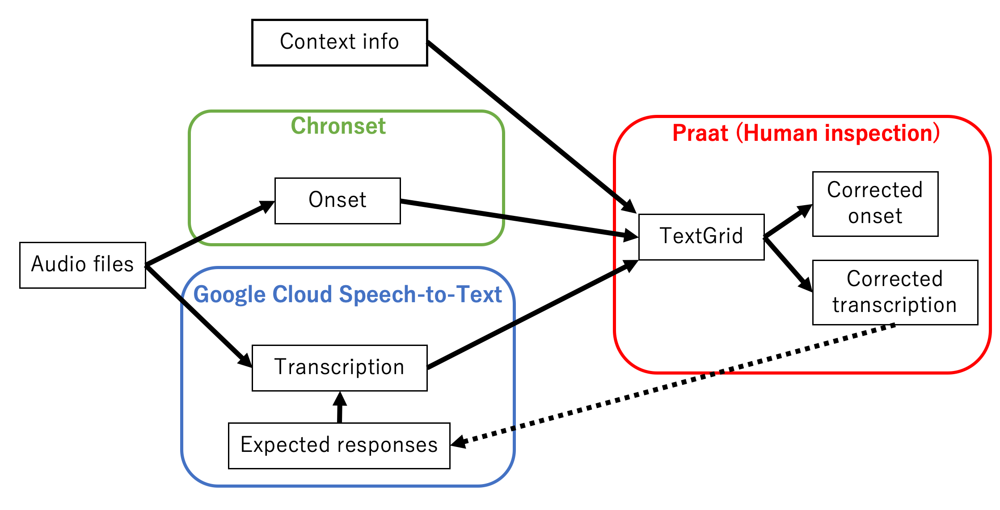

# Overview

The TransCloze pipline facilitates automatic processing of speech production data. This pipeline detects the onset of the speech data, and provides machine-based transcriptions. The aim is to speed up the time-consuming processing of the speech data. I recommend you not to completely rely on the automated trascriptions/onsets but check each data by yourself, but it will still significantly facilitate speech data analysis.

**The aim is not to magically generate perfect transcriptions but to have a reasonably good starting point that requires minimal work to correct!**


This is designed to be especially useful for the online speeded cloze task (or the sentence completion task), or other kinds of speech data that have some if not all of the following features:

1. Open-ended but constrained responses
2. Short speech (mostly a single word)
3. Contain some irrelevant noise (such as data collected online)
4. The latencies of responses are valuable data




The main body of this pipleline is the TransCloze.py module, which takes .wav files and:

1. Gets onset data from [Chronset](https://www.bcbl.eu/databases/chronset/)
2. Gets automatic transcription from [Google Cloud Speech-to-Text API](https://cloud.google.com/speech-to-text)
3. Combines the information + context/probe info of the experiment and output them as Praat TextGrids (which can be inspected by humans)
4. Use the human-corrected transcription to improve automatic transcription.
5. Generates a csv file that contians the machine-genrated or human-corrected trasncription and onset information,, which can be easily analyzed by other scripts.


This pipeline also contains a few supplementary scripts:

1. webm2wav: Transforms PCIbex outputs (.webm files) into wav files
2. CheckAndEdit: Facilitates human inspection of machine-generated onsets and transcriptions in Praat


## Instructions

* This pipeline is built for OSX. This should work for other major OS's but it might need some modification.

* If you have any questons, please contact Masato Nakamura (mnaka@umd.edu).

### Preperation

### Installation

Please download the entire folder and place it whereever you want. Make sure to add the path to the TransCloze folder using `sys.path.append(Path_To_TransCloze)` function before importing TransCloze.py.

#### Data preperation

- The wav of webm files must have names following a specific naming rule. It must contain the trial type, the item ID with one-letter condition code, and the participant ID, each of which separated by underscores (e.g. exp_10a_tdlf.webm). The trial type and the subject ID can be whatever strings that do not contain underscores. The second part indicating the item information ("10a" in the example above) can also be whatever string, but if you want to generate a csv file using this pipeline, it must be a combination of one number (however many digits will be fine) and one alphabet following it.
- Optional: If you want to include some additional information in Praat Text Grid files to aid human inspection or in csv files for analysis, and you can have a python dictionary that maps item information (e.g. "10a") onto the information. (e.g. If you want to show the stimuli/context in the Praat Text Grid files, {"10a": "The dog bit the", "10b": "The man bit the", ...}).

### Converting webm files to wav files (webm2wav)

If you collected your data online using PCIbex, you will get webm files. However Praat, Chronest and Google Cloud Speech-to-Text API all don't accept webm files, so you need to convert them into wav files. ffmpeg is a free software that can do this, but it is not straightforward to convert files in different folders, since the output audio files of PCIbex are usually separated by participants. The "webm2wav" file recursively convert all the webm wiles below a certain directory at once.

#### Requirements

- [ffmpeg](https://ffmpeg.org/)

#### Instructions

Enter the following line into your command line substituting the arguments.

```bash
bash location_of_webm2wav input_file_directory output_file_directory
```

- First argument:  the path to "webm2wav" file
- Second argument: the path to the directory which contaions all the webm files
- Third argument: the path to the output directory

NOTE: All the wav files below the input directry will be generated directly in the output directory


### Generating automatic transcription and onset data (TransCloze.py)

#### Requirements

* numpy
* pandas

* [google-cloud-speech](https://pypi.org/project/google-cloud-speech/) (Only required for `transcribe()`)
* [praat-textgrids](https://pypi.org/project/praat-textgrids/)
* [pydub](https://github.com/jiaaro/pydub) (Only required for `stereo2monaural()` and `generate_textgrid()`)


#### Functions

This python module contains a set of useful functions for automatic transcription and onset detection.

Here is a list of short descriptions of the functions: 

- `stereo2monaural()` Convert stereo files to monaural files.
- `chronset_prep()` Create zip files that can be sent to Chronset for onset detection.
- `chronset_dict()` Read Chronset outputs and generate a dictionary that maps each file name onto the estimated production onset latency.
- `transcribe()` Generate transcription of audio files using Google Speech-to-Text API.
- `generate_textgrid()` Generate TextGrid files from the outputs of `transcribe()`.
- `generate_csv()` Generate a CSV files from (machine-generated or human-corrected) TextGrid files.
- `get_keywords()` Get candidate transcriptions from human-corrected TextGrid files. The output dictionary can be used to constrain transcriptions.
- `extract_rows()` Extract relevant rows including keywords from a PCIbex result file and generate a pandas dataframe with column names.

For the detailed use of the TransCloze module, please see Sample.ipynb. You can also use `help(TransCloze.NAME_OF_FUNCTION)` functions to see the description of each function in the module.


* Make sure you have temp_note.TextGrid, which is a template required to generate TextGrid files, in the same directory as TransCloze.py.

* Be careful that Google Cloud Speech-to-Text API is a paid service, and you need to set up your own [Google Cloud Platform](https://cloud.google.com/) account to use this pipeline. I decided to use this pipeline for its accuracy and its feature to constrain the candidates of transcription. Good news is that you can use it practically for free for the first 90 days.

### Human inspection of transcriptions and onsets (CheckAndEdit)

Once you have the machine-generated trancriptions and onsets, you would want to correct them by manual inspection. CheckAndEdit facilitates this process by automatically (i) openning a wav file and a TextGrid file together, (ii) and saving the edits you made, and (iii) moving to the next wav & TextGrid file.

Simply enter the path to the wav files and textgrids to the box, and then the corresponding files are opened at once. Be careful that the script overwrites the TextGrid file once you click on "continue".
